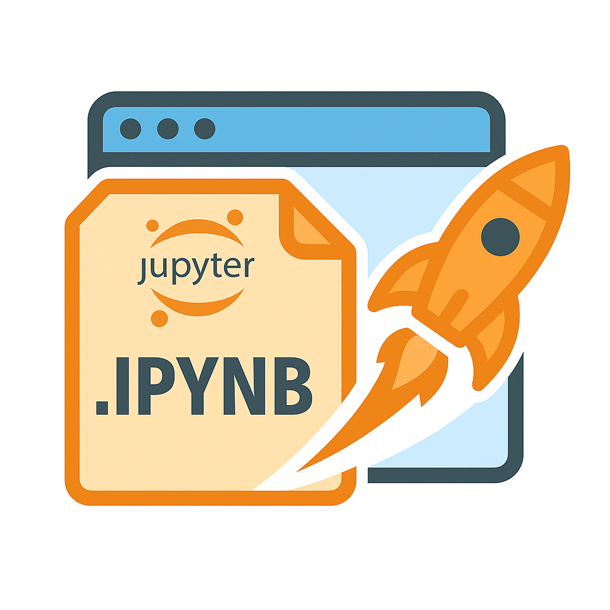

<p align="center">
  
  <br><br>
  <strong>A seamless way to open Jupyter Notebooks from your file manager using the system browser.</strong>
  <br><br>
  <a href="#-features"><strong>✨ Explore Features »</strong></a>
  <br><br>
  
  
  
</p>

---

## 📚 Table of Contents

- [📖 About](#-about)
- [✨ Features](#-features)
- [🛠 Tech Stack](#-tech-stack)
- [🚀 Installation](#-installation)
- [🪪 License](#-license)
- [🤝 Contact & Contribution](#-contact--contribution)

---

## 📖 About

This repository provides a **desktop-integrated launcher** for `.ipynb` files on Linux. It allows users to open Jupyter Notebooks in their **default web browser** simply by double-clicking the file in a file manager like Nautilus or Dolphin.

It ensures:
- A Jupyter server starts if not already running
- The selected notebook opens in the browser automatically
- Uses your system's **default browser**, not hardcoded to any

---

## ✨ Features

- ✅ Automatically opens selected `.ipynb` in the browser  
- 🚀 Starts a Jupyter server in the background (if none is running)  
- 🌐 Opens in the system default browser  
- 📂 Respects notebook location and file structure  
- 🖱️ Integrated via a desktop entry (`.desktop`)  
- 🧠 URL-safe encoding and robust edge-case handling  

---

## 🛠 Tech Stack

- 🐧 Bash  
- 📓 Jupyter Notebook  
- 🧠 `readlink`, `realpath`, `grep`, `nohup`, `xdg-open`  
- 🖥️ Linux Desktop Environments (GNOME, KDE, etc.)  
- 🧪 Compatible with Anaconda / Python venv  

---

## 🚀 Installation

1. **Clone the repo**:
   ```bash
   git clone https://github.com/omarZACK/Jupyter-Notebook-Opener.git
   cd Jupyter-Notebook-Opener
   ```

2. **Make the installation script executable**:
   ```bash
   chmod +x install.sh
   ```

3. **Run the installation script to configure the Notebook Opener**:
   ```bash
   ./install.sh
   ```
   
---

## 🪪 License

This project is licensed under the [MIT License](LICENSE).

---

## 🤝 Contact & Contribution

Have a suggestion, bug report, or feature request? Feel free to open an issue or PR!

**Created by [omarZACK](https://github.com/omarZACK)** — contributions are welcome and appreciated.  
Please ⭐ the repo if you found it helpful!